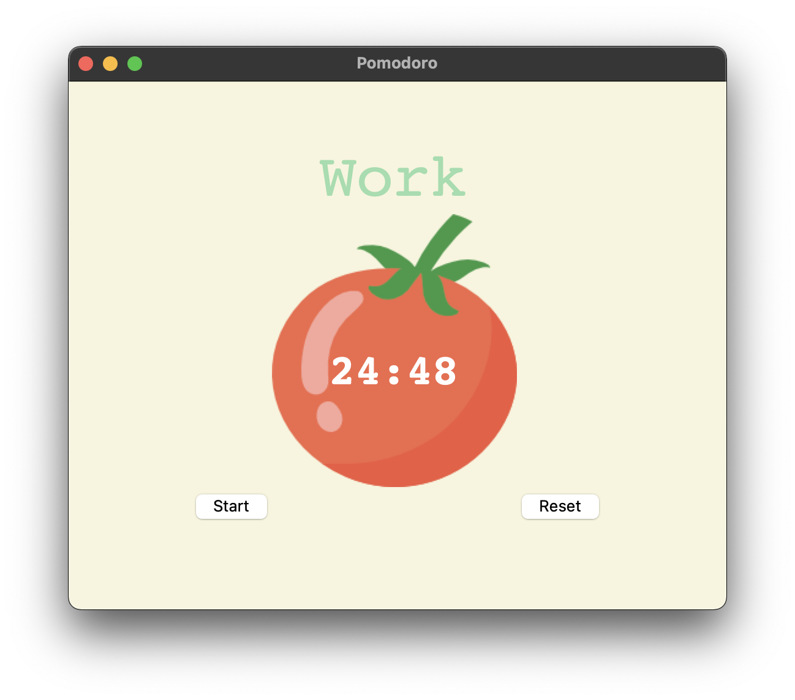

# About

This is a beautiful and simple pomodoro app built using python.

## Preview

## What is Pomodoro Technique
The Pomodoro Technique is a productivity system that stops you from procrastinating or getting distracted, so you can focus on getting stuff done. The idea is simple: set a timer for 25 minutes, work until it runs out, then take a 5-minute break—and repeat the process three more times. After that, take a 15- to 30-minute break. That's one full Pomodoro cycle. 
